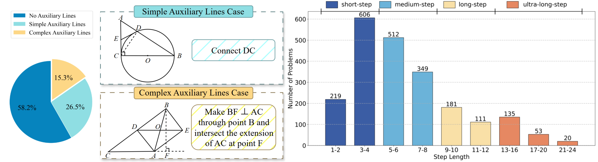
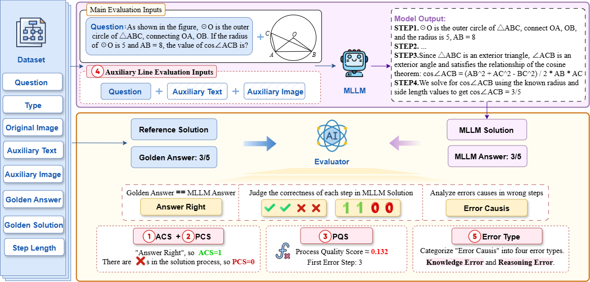

<div align="center">
<h1 style="font-size: 1.9em;">GeoLaux: A Benchmark for Evaluating MLLMs' Geometry Performance on Long-Step Problems Requiring Auxiliary Lines</h1>
</div>

## 💥 News 💥

**[2024.08.08]** Our paper is now accessible at https://arxiv.org/abs/2508.06226.

## 📚GeoLaux Dataset

GeoLaux is a challenging plane geometry dataset with 2,186 problems. It demonstrates three key advantages over comparable datasets: **(1) Long Steps:** With solutions reaching up to 24 steps, far exceeding previous benchmarks' maximum of 11 steps, GeoLaux poses significant challenges for models. **(2)** **Unique Auxiliary Line Annotation:** To the best of our knowledge, GeoLaux is the first and only benchmark to provide complete, explicit annotations for auxiliary line construction methods in geometry problems, addressing a critical gap in prior work. **(3) Integrated Calculation and Proving Problems:** GeoLaux comprises 1,418 calculation and 768 proving problems.



<div align="center">
<p>The step length and auxiliary lines distribution of GeoLaux</p>
</div>

we have placed GeoLaux-mini in the "data" folder, which contains 330 questions uniformly sampled from GeoLaux.

## 🚀 Evaluation Pipeline



<div align="center">
<p>Five-dimension evaluation framework of GeoLaux. Given golden answer and solution from dataset, evaluator assesses MLLM outputs for answer correctness, step-by-step scoring, and error analysis, enabling framework's comprehensive evaluation across: ① answer correctness, ② process correctness, ③ process quality, ④ auxiliary line impact, and ⑤ error type.</p>
</div>


### 📜Solution Generation

First, obtain the MLLM's problem-solving process on GeoLaux. We take the approach for obtaining closed-source large models as an example.

```bash
cd evaluation
python closedsource_get_ans.py \
    --model_name YourModel \
    --output_json ../answers/YourModel.json 
```

### ✒️Evaluator Analysis

After obtaining the large model's reasoning process, the resulting JSON data is sequentially fed into the evaluator for step-by-step scoring. Here, our default evaluator is o4-mini.

```bash
cd evaluation
python evaluate_score.py \
    --model_name YourModel \
    --input_json ../answers/YourModel.json \
    --output_json ../scores/YourModel.json
```

The step-by-step scores are then input into the evaluator to analyze the error types in incorrect steps.

```bash
cd evaluation
python evaluate_error_type.py \
    --model_name YourModel \
    --input_json ../scores/YourModel.json \
    --output_json ../errors/YourModel.json
```

### 📈Metric Calculation

After obtaining the step-by-step scores, we can calculate the model's ACS and PCS across four step-length categories - along with the average ACS, PCS, and PQS - using the three_metrics.py script to compare with the results reported in the paper.

```bash
cd evaluation
python three_metrics.py \
    --model_name YourModel \
    --input_json ../scores/YourModel.json \
    --output_json ../metric/YourModel.json
```

### 📌Note!

Please remenber to replace your openai key in "closedsource_get_ans.py", "evaluate_score.py" and "evaluate_error_type.py".

```python
client = OpenAI(
    base_url="replace_with_your_base_url",
    api_key="replace_with_your_key"
)
```


## 📊Experimental Results

### 📍Model's performance on GeoLaux.

<table>
  <thead>
    <tr>
      <th rowspan="2" style="text-align: center;">Model</th>
      <th colspan="2" style="text-align: center;">1 – 4 Steps</th>
      <th colspan="2" style="text-align: center;">5 – 8 Steps</th>
      <th colspan="2" style="text-align: center;">9 – 12 Steps</th>
      <th colspan="2" style="text-align: center;">13 – 24 Steps</th>
      <th colspan="1" style="text-align: center;">All Steps</th>
      <th colspan="3" style="text-align: center;">AVG</th>
    </tr>
    <tr>
      <th>ACS</th>
      <th>PCS</th>
      <th>ACS</th>
      <th>PCS</th>
      <th>ACS</th>
      <th>PCS</th>
      <th>ACS</th>
      <th>PCS</th>
      <th>ΔPCS(%)</th>
      <th>ACS</th>
      <th>PCS</th>
      <th>PQS</th>
    </tr>
  </thead>
  <tbody>
    <tr>
      	<td colspan="14" style="text-align: center;"><b>Thinking MLLMs</b></td>
    </tr>
    <tr>
      <td>QvQ-72B</td>
      <td>69.6</td>
      <td>22.4</td>
      <td>52.7</td>
      <td>6.6</td>
      <td>27.4</td>
      <td>1.7</td>
      <td>14.0</td>
      <td>1.2</td>
      <td>94.6</td>
      <td>52.1</td>
      <td>11.4</td>
      <td>21.0</td>
    </tr>
    <tr>
      <td>o3-mini</td>
      <td>60.7</td>
      <td>21.8</td>
      <td>54.7</td>
      <td>13.0</td>
      <td>39.7</td>
      <td>12.7</td>
      <td>16.5</td>
      <td>5.5</td>
      <td>74.8</td>
      <td>51.8</td>
      <td>15.7</td>
      <td>27.2</td>
    </tr>
    <tr>
      <td>o1</td>
      <td>86.3</td>
      <td>64.5</td>
      <td>80.9</td>
      <td>57.3</td>
      <td>82.9</td>
      <td>61.0</td>
      <td>42.9</td>
      <td>35.7</td>
      <td>44.7</td>
      <td>79.7</td>
      <td>58.8</td>
      <td>68.6</td>
    </tr>
    <tr>
      <td>Gemini-2.0-Thinking</td>
      <td>89.7</td>
      <td>72.2</td>
      <td>81.6</td>
      <td>53.4</td>
      <td>64.7</td>
      <td>34.9</td>
      <td>40.2</td>
      <td>17.7</td>
      <td>75.5</td>
      <td>78.7</td>
      <td>54.9</td>
      <td>72.9</td>
    </tr>
    <tr>
      <td>o4-mini</td>
      <td>94.5</td>
      <td>78.3</td>
      <td><b>94.0</b></td>
      <td>70.3</td>
      <td>91.4</td>
      <td>70.2</td>
      <td><b>81.1</b></td>
      <td><b>63.4</b></td>
      <td><b>19.0</b></td>
      <td><b>92.8</b></td>
      <td>72.9</td>
      <td>81.1</td>
    </tr>
    <tr>
      <td>o3</td>
      <td>94.4</td>
      <td>83.9</td>
      <td>93.9</td>
      <td><b>80.9</b></td>
      <td><b>92.7</b></td>
      <td>73.2</td>
      <td>78.6</td>
      <td>53.6</td>
      <td>36.1</td>
      <td>92.4</td>
      <td><b>78.5</b></td>
      <td>86.0</td>
    </tr>
    <tr>
      <td>Gemini-2.5-Pro</td>
      <td><b>95.3</b></td>
      <td><b>85.9</b></td>
      <td>92.2</td>
      <td>76.2</td>
      <td>88.0</td>
        <td><b>76.0</b></td>
      <td>71.3</td>
      <td>50.0</td>
      <td>41.8</td>
      <td>91.2</td>
      <td>77.8</td>
      <td><b>88.6</b></td>
    </tr>
    <tr>
      <td colspan="14" style="text-align: center;"><b>Non-Thinking MLLMs</b></td>
    </tr>
    <tr>
      <td>GPT-4o</td>
      <td>57.7</td>
      <td>14.7</td>
      <td>49.4</td>
      <td>2.8</td>
      <td>28.1</td>
      <td>0.3</td>
      <td>10.4</td>
      <td>0.6</td>
      <td>95.9</td>
      <td>46.1</td>
      <td>6.7</td>
      <td>20.4</td>
    </tr>
    <tr>
      <td>InternVL2.5-78B-MPO</td>
        <td><b>78.4</b></td>
      <td>34.1</td>
      <td>58.2</td>
      <td>9.5</td>
      <td>31.2</td>
      <td>1.4</td>
      <td>14.0</td>
      <td>0.0</td>
      <td>100.0</td>
      <td>58.0</td>
      <td>16.8</td>
      <td>30.7</td>
    </tr>
    <tr>
      <td>InternVL2.5-78B</td>
      <td>74.2</td>
      <td>35.8</td>
      <td>55.2</td>
      <td>9.8</td>
      <td>26.4</td>
      <td>0.0</td>
      <td>11.6</td>
      <td>0.6</td>
      <td>98.3</td>
      <td>54.4</td>
      <td>17.4</td>
      <td>32.2</td>
    </tr>
    <tr>
      <td>Claude-3.7</td>
      <td>68.5</td>
      <td>21.0</td>
      <td>55.4</td>
      <td>6.6</td>
      <td>30.1</td>
      <td>2.1</td>
      <td>14.0</td>
      <td>1.8</td>
      <td>91.4</td>
      <td>53.1</td>
      <td>10.9</td>
      <td>35.4</td>
    </tr>
    <tr>
      <td>GPT-4.1</td>
      <td>70.2</td>
      <td>22.2</td>
      <td><b>61.0</b></td>
      <td>9.9</td>
      <td><b>40.1</b></td>
      <td><b>5.8</b></td>
      <td><b>18.9</b></td>
      <td><b>4.3</b></td>
      <td><b>80.6</b></td>
      <td>57.8</td>
      <td>13.4</td>
      <td>36.3</td>
    </tr>
    <tr>
      <td>Qwen2.5-VL-72B</td>
      <td>77.5</td>
        <td><b>39.5</b></td>
      <td>59.5</td>
        <td><b>14.1</b></td>
      <td>30.5</td>
      <td>0.7</td>
      <td>16.5</td>
      <td>1.2</td>
      <td>97.0</td>
      <td><b>58.4</b></td>
      <td><b>20.6</b></td>
      <td><b>37.3</b></td>
    </tr>
  </tbody>
</table>


ACS = Answer Correctness Score, PCS = Process Correctness Score, PQS = Process Quality Score. ΔPCS indicates the relative percentage decrease in PCS across 1-24 steps.

**Our analysis reveals three critical findings:**

1. **MLLMs perform poorly on long-step reasoning:** All models exhibit substantial performance degradation as step increases. Nine models shows performance drop over 50%  from short-step to ultra-long-step problems, with some exceeding 90% or even reaching 100%.
2. **MLLMs exhibit laziness in proving:** Compared to calculation problems, models show higher answer correctness scores but lower process correctness scores on proving problems, indicating they often "cheat" by leveraging given conclusions while neglecting reasoning steps.
3. **MLLMs Struggle with Auxiliary Line Construction:** MLLMs fail to construct complex auxiliary lines when solving problems. Following auxiliary line prompts, nearly all models demonstrate increased performance, indicating that enhancing models' awareness and capability in auxiliary line construction can significantly improve their geometry reasoning performance.

## 🔖 License

Our dataset and code are distributed under the [MIT](LICENSE) license.

## 📖 Citation

If you find GeoLaux useful for your research and applications, please kindly cite our paper:

```bibtex
@misc{fu2025geolauxbenchmarkevaluatingmllms,
      title={GeoLaux: A Benchmark for Evaluating MLLMs' Geometry Performance on Long-Step Problems Requiring Auxiliary Lines}, 
      author={Yumeng Fu and Jiayin Zhu and Lingling Zhang and Bo Zhao and Shaoxuan Ma and Yushun Zhang and Yanrui Wu and Wenjun Wu},
      year={2025},
      eprint={2508.06226},
      archivePrefix={arXiv},
      primaryClass={cs.AI},
      url={https://arxiv.org/abs/2508.06226}, 
}
```

---

<div align="center">
<sub>⭐ If you find this project useful, please consider giving it a star! ⭐</sub>
</div>

